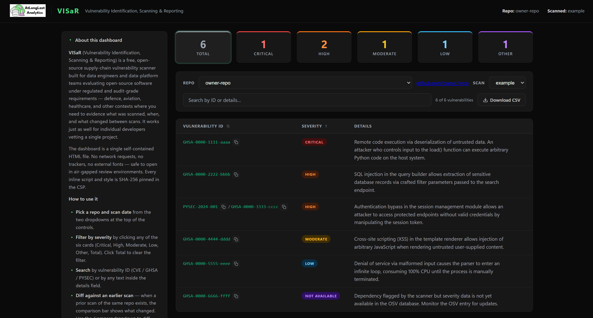

<br>

</img>

# Welcome to VISaR
[](https://github.com/AtLongLastAnalytics/visar/actions/workflows/ci.yml)
[](LICENSE)
[](https://www.python.org/)

**Free, open-source vulnerability scanning and reporting for GitHub repositories.**

## What is VISaR?

VISaR (Vulnerability Identification, Scanning and Reporting) is a free, open-source Python tool that automatically scans GitHub repositories for known vulnerabilities and generates detailed, actionable reports. Output is available in CSV, JSON, or as a self-contained interactive HTML dashboard, making it easy to review, share, and act on findings.

VISaR uses best-in-class open-source components: the [OSSF Scorecard](https://github.com/ossf/scorecard) for vulnerability identification and the [OSV Database](https://osv.dev/) for vulnerability enrichment (severity, description, and aliases).

<div align="center">
    
</div>

<div align="center">
     <p><strong>Figure 1:</strong> Interactive HTML Dashboard</p>
</div>

**Who is VISaR for?**

VISaR is built first for **data engineers and data-platform teams** who must rigorously evaluate open-source software before bringing it into their environment — particularly in regulated domains such as defence, aviation, and healthcare, where software ingestion carries compliance and audit obligations.

- **Data Engineers & data-platform teams:** Evaluate open-source libraries and frameworks before adding them to an approved-software list or integrating them into your platform.
- **Software Engineers:** Assess your own codebase for known vulnerabilities before a release or production deployment.

Individual developers and hobbyists are welcome too — VISaR is free and open source, and works just as well for vetting a single project or code sourced from the community or AI assistants.

## Quick Start

```bash
# 1. Clone and install
git clone https://github.com/AtLongLastAnalytics/visar.git && cd visar
uv sync

# 2. Add your GitHub token
cp .env.example .env   # then paste your token into .env

# 3. Scan a repo (writes CSV to data/)
uv run visar https://github.com/owner/repo

# 4. Build the interactive HTML dashboard from your scans
uv run visar-dashboard   # writes data/visar_dashboard.html
```

> Full prerequisites, options, and batch scanning in [Section 1](#1-using-visar).

## 1. Using VISaR

<details>
<summary><strong>Prerequisites &amp; system requirements</strong></summary>

<br>

To use VISaR, ensure you have the following installed and configured:

- [uv](https://docs.astral.sh/uv/) — Python package and environment manager. uv will automatically download Python 3.12+ if needed.
- [Docker Desktop](https://www.docker.com/products/docker-desktop/) — required to run the OSSF Scorecard container.
- The OSSF Scorecard Docker image, pulled locally:

    ```
    docker pull gcr.io/openssf/scorecard:stable
    ```

- A classic GitHub personal access token _(Settings > Developer Settings > Personal access tokens > Tokens (classic))_ with the `public_repo` scope. This is stored in a `.env` file at the project root (never committed to version control). The `public_repo` scope grants **read-only API access** for authenticated rate limiting — it does not allow VISaR to modify, write to, or delete any repository.

**System requirements**

- Python 3.12+ (managed automatically by uv)
- Docker Desktop with at least 2 GB of available memory
- Network access to the GitHub API (`api.github.com`) and the OSV API (`api.osv.dev`)
- Approximately 1 GB of free disk space for the OSSF Scorecard Docker image

> **Scan duration:** A typical scan takes **2–5 minutes** per repository, depending on repo size and network speed. Batch scans run sequentially, so plan accordingly.

</details>

<details>
<summary><strong>Install uv</strong> (skip if already installed)</summary>

<br>

**Windows (PowerShell):**
```
powershell -ExecutionPolicy ByPass -c "irm https://astral.sh/uv/install.ps1 | iex"
```

**Mac / Linux:**
```
curl -LsSf https://astral.sh/uv/install.sh | sh
```

</details>

<details>
<summary><strong>Step-by-step instructions</strong></summary>

<br>

1. Clone this repository.

2. Create a `.env` file in the root directory and add your GitHub token:

    ```
    VISAR_AUTH_TOKEN = "<your-github-personal-access-token>"
    ```

    A `.env.example` template is included at the project root for reference.

3. From the root directory, install dependencies. This creates `.venv` and installs everything from `pyproject.toml` in one step:

    ```
    uv sync
    ```

4. From the root directory, run the test suite to verify everything is working:

    ```
    uv run python -m unittest discover -s tests
    ```

   All tests should pass. If any fail, check the error message and ensure Docker Desktop is running and the OSSF Scorecard image has been pulled.

5. Run the application from the **project root**. `uv sync` installs VISaR's two console commands, `visar` (scan) and `visar-dashboard` (HTML report), so there is no need to change directories or use Python's `-m` module flag:

   **Single repository scan (default CSV output):**
    ```
    uv run visar <full-github-repo-url>
    ```

   **Single repository scan with JSON output:**
    ```
    uv run visar <full-github-repo-url> --output-format json
    ```

   **Batch scan — scan multiple repositories from a text file:**
    ```
    uv run visar --batch repos.txt
    uv run visar --batch repos.txt --output-format json
    ```

   The batch file should contain one GitHub repository URL per line. Lines starting with `#` and blank lines are ignored. A `repos.txt.example` file is provided as a template — copy it to `repos.txt` and replace the contents with your own repos (`repos.txt` is gitignored).

   **Generate an HTML dashboard from all scan outputs in a directory:**
    ```
    uv run visar-dashboard
    ```

   Or point to a specific data directory:
    ```
    uv run visar-dashboard <path-to-data-dir>
    ```

   **Want to see the dashboard before running your own scan?** Point it at the bundled example datasets in `examples/`:
    ```
    uv run visar-dashboard examples
    ```

   > Prefer module form? The package can still be launched directly with `uv run python -m visar.main` / `uv run python -m visar.dashboard` from the `src/` directory.

   The dashboard is an ad-hoc step — run scans as many times as needed first, then generate the HTML report when you are ready to review. A single self-contained `visar_dashboard.html` is written to the chosen directory (`data/` by default), embedding all scan datasets. Real scans live in `data/`; the bundled example datasets live in `examples/`, so they never get mixed into a dashboard of your real findings. Use the dropdown to switch between scans, the date filter to narrow by scan date, and the severity pills to focus on the most critical findings. Rows can be expanded to read the full vulnerability detail.

</details>

**Output**

The output file generated by a successful run is placed in the `data/` directory. The default CSV format is ready to open in Microsoft Excel or any spreadsheet tool — see Figure 2. The key columns for decision-making are **Severity** and **Details**, which together describe each finding.

<br>
<br>

<div align="center">
    
</div>

<div align="center">
     <p><strong>Figure 2:</strong> Example VISaR Output (CSV)</p>
</div>

Running with `--output-format json` produces the same findings as an array of objects with identical fields (`VulnerabilityID`, `Severity`, `Details`) — convenient for piping into other tooling:

```json
[
  {
    "VulnerabilityID": "GHSA-0000-1111-aaaa",
    "Severity": "CRITICAL",
    "Details": "Remote code execution via deserialization of untrusted data. An attacker who controls input to the load() function can execute arbitrary Python code on the host system."
  },
  {
    "VulnerabilityID": "GHSA-0000-6666-ffff",
    "Severity": "NOT AVAILABLE",
    "Details": "Dependency flagged by the scanner but severity data is not yet available in the OSV database. Monitor the OSV entry for updates."
  }
]
```

Example logs for a successful run and a failed run are provided in the [logs directory](./logs/). Example scan output files (CSV and JSON) are provided in the [examples directory](./examples/); these show the format a real scan produces and can be used to generate a dashboard without running a full scan.

<details>
<summary><strong>CLI reference</strong></summary>

<br>

| Argument | Type | Default | Description |
|---|---|---|---|
| `repo_url` | positional | — | Full GitHub repository URL. Required unless `--batch` is used. |
| `--batch FILE` | optional | — | Path to a text file containing one URL per line. Use instead of `repo_url`. |
| `--output-format FORMAT` | optional | `csv` | Output format: `csv` or `json`. |
| `-h` / `--help` | flag | — | Display help message and exit. |

**Exit codes:** `0` — completed successfully (including when no vulnerabilities are found). `1` — scan failed; see the `logs/` directory for details.

</details>

## 2. Technical Overview
The user provides a GitHub repository URL to VISaR, which automatically performs a vulnerability scan, queries the OSV API to enrich findings, and writes a structured report in the chosen format.

**How VISaR works:**

The workflow below aligns with the architecture diagram shown in Figure 3.

  1. OSSF Scorecard scans the repository and generates a summary file.
  2. A second OSSF Scorecard scan generates a file of known vulnerabilities (saved temporarily).
  3. A list of vulnerability IDs is extracted from the temporary file.
  4. Vulnerability IDs are sent to the OSV API to retrieve severity ratings and plain-text descriptions.
  5. Key vulnerability information is extracted from the API response.
  6. The vulnerability IDs, severity, and descriptions are compiled into a structured report (CSV or JSON, depending on the `--output-format` flag).

<br>

<div align="center">
    
</div>

<div align="center">
     <p><strong>Figure 3:</strong> VISaR Architecture Diagram</p>
</div>

<details>
<summary><strong>Project structure</strong></summary>

<br>

The VISaR codebase follows a standard `src/` layout.

- The application code is the `visar` package in `src/visar/`. `main.py` is the scan entry point (exposed as the `visar` command) and `dashboard.py` is the HTML report entry point (exposed as the `visar-dashboard` command). Both console scripts are declared under `[project.scripts]` in `pyproject.toml`.

- The `helpers/` package is a collection of modules, each containing a logical grouping of functions used in the main pipeline. `dashboard_funcs.py` handles all HTML generation and is intentionally separate from the scan pipeline.

- Each module in `helpers/` has an associated test file in `tests/`. Within each test script, all tests for a given function are grouped into their own class. We aim for close to 100% test coverage.

- Run details are captured in a `.log` file in the `logs/` directory. If a run fails, this is the first place to look.

- The `data/` directory contains scan output files, named by date and repository (e.g. `20260320-owner-repo_vulnids.csv`). The suffix depends on the chosen format: `_vulnids.csv` (default) or `_vulnids.json`. Running `python -m visar.dashboard` writes a single `visar_dashboard.html` to this directory, embedding all scan datasets. Its contents are gitignored (a `.gitkeep` preserves the empty folder on a fresh clone) so your real findings are never committed.

- The `examples/` directory holds the bundled example datasets (`example-owner-repo_vulnids.csv` / `.json`). These are kept separate from `data/` so they never get mixed into a dashboard of real scan results; point `python -m visar.dashboard` at this folder to preview the report without running a scan.

- Project dependencies are declared in `pyproject.toml` at the root. Running `uv sync` creates `.venv` and installs everything. The `scripts/` directory contains `setup.ps1` (Windows) and `setup.sh` (Mac/Linux) as convenience wrappers around `uv sync`.

</details>

## 3. Known Limitations

- **GitHub only:** VISaR currently supports public GitHub repositories. GitLab and Bitbucket support is planned — see the [roadmap](docs/ROADMAP.md).
- **Public repos only:** Private repository scanning is not yet supported.
- **Docker required:** Docker Desktop must be running before executing a scan.
- **Sequential batch scans:** Repositories in `repos.txt` are scanned one at a time; large batches will take proportionally longer.

## 4. Project Status

- **Roadmap** — planned features and future direction: [docs/ROADMAP.md](./docs/ROADMAP.md)
- **Changelog** — version history: [docs/CHANGELOG.md](./docs/CHANGELOG.md)
- **Contributing** — contributions are welcome. Please read [.github/CONTRIBUTING.md](./.github/CONTRIBUTING.md) (code style, linting, testing) before opening a PR; contributions are licensed under Apache-2.0.
- **Security** — to report a vulnerability, see [.github/SECURITY.md](./.github/SECURITY.md).
- **License** — VISaR is free and open-source under the [Apache-2.0 License](LICENSE).
