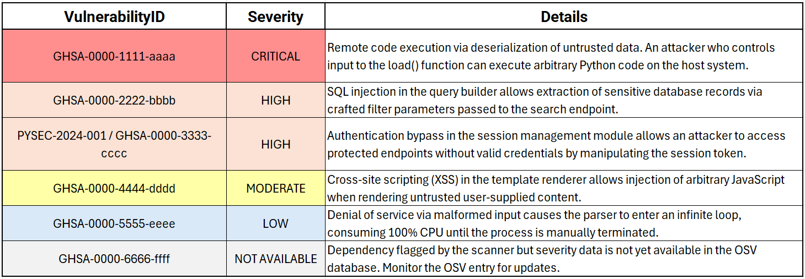
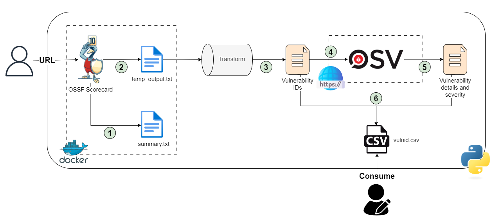

<br>

</img>

# Welcome to VISaR
[](https://github.com/AtLongLastAnalytics/visar/actions/workflows/ci.yml)
[](LICENSE.txt)
[](https://www.python.org/)

**Free, open-source vulnerability scanning and reporting for GitHub repositories.**

## What is VISaR?

VISaR (Vulnerability Identification, Scanning and Reporting) is a free, open-source Python tool that automatically scans GitHub repositories for known vulnerabilities and generates detailed, actionable reports. Output is available in CSV, JSON, or as a self-contained interactive HTML dashboard, making it easy to review, share, and act on findings.

VISaR uses best-in-class open-source components: the [OSSF Scorecard](https://github.com/ossf/scorecard) for vulnerability identification and the [OSV Database](https://osv.dev/) for vulnerability enrichment (severity, description, and aliases).

**Who is VISaR for?**

- **Data Engineers:** Evaluate open-source libraries and frameworks before integrating them into your data platform.
- **Software Engineers:** Assess your codebase for known vulnerabilities before a release or production deployment.
- **Independent Developers and Hobbyists:** Verify code generated by AI assistants or sourced from the community.


## 1. Using VISaR

**Pre-requisites**

To use VISaR, ensure you have the following installed and configured:

- [uv](https://docs.astral.sh/uv/) — Python package and environment manager. uv will automatically download Python 3.12+ if needed.
- [Docker Desktop](https://www.docker.com/products/docker-desktop/) — required to run the OSSF Scorecard container.
- The OSSF Scorecard Docker image, pulled locally:

    ```
    docker pull gcr.io/openssf/scorecard:stable
    ```

- A classic GitHub personal access token _(Settings > Developer Settings > Personal access tokens > Tokens (classic))_ with the `public_repo` scope. This is stored in a `.env` file at the project root (never committed to version control).

**System Requirements**

- Python 3.12+ (managed automatically by uv)
- Docker Desktop with at least 2 GB of available memory
- Network access to the GitHub API (`api.github.com`) and the OSV API (`api.osv.dev`)
- Approximately 1 GB of free disk space for the OSSF Scorecard Docker image

**Install uv** (skip if already installed):

   **Windows (PowerShell):**
   ```
   powershell -ExecutionPolicy ByPass -c "irm https://astral.sh/uv/install.ps1 | iex"
   ```

   **Mac / Linux:**
   ```
   curl -LsSf https://astral.sh/uv/install.sh | sh
   ```

**Step-by-Step Instructions**

1. Clone this repository.

2. Create a `.env` file in the root directory and add your GitHub token:

    ```
    GITHUB_AUTH_TOKEN = "<your-github-personal-access-token>"
    ```

    A `.env.example` template is included at the project root for reference.

3. From the root directory, install dependencies. This creates `.venv` and installs everything from `pyproject.toml` in one step:

    ```
    uv sync
    ```

4. From the root directory, run the test suite to verify everything is working:

    ```
    uv run python -m unittest discover -s tests
    ```

   All tests should pass. If any fail, check the error message and ensure Docker Desktop is running and the OSSF Scorecard image has been pulled.

5. Move into the `src/` folder and run the application:

   **Single repository scan (default CSV output):**
    ```
    cd src/
    uv run python main.py <full-github-repo-url>
    ```

   **Single repository scan with JSON output:**
    ```
    uv run python main.py <full-github-repo-url> --output-format json
    ```

   **Batch scan — scan multiple repositories from a text file:**
    ```
    uv run python main.py --batch ../repos.txt
    uv run python main.py --batch ../repos.txt --output-format json
    ```

   The batch file should contain one GitHub repository URL per line. Lines starting with `#` and blank lines are ignored. A `repos.txt.example` file is provided as a template — copy it to `repos.txt` and replace the contents with your own repos (`repos.txt` is gitignored).

   **Generate an HTML dashboard from all scan outputs in a directory:**
    ```
    uv run python dashboard.py
    ```

   Or point to a specific data directory:
    ```
    uv run python dashboard.py <path-to-data-dir>
    ```

   The dashboard is an ad-hoc step — run scans as many times as needed first, then generate the HTML report when you are ready to review. A single self-contained `dashboard.html` is written to the `data/` directory, embedding all scan datasets. Use the dropdown to switch between scans, the date filter to narrow by scan date, and the severity pills to focus on the most critical findings. Rows can be expanded to read the full vulnerability detail.

**CLI Reference**

| Argument | Type | Default | Description |
|---|---|---|---|
| `repo_url` | positional | — | Full GitHub repository URL. Required unless `--batch` is used. |
| `--batch FILE` | optional | — | Path to a text file containing one URL per line. Use instead of `repo_url`. |
| `--output-format FORMAT` | optional | `csv` | Output format: `csv` or `json`. |
| `-h` / `--help` | flag | — | Display help message and exit. |

**Exit codes:** `0` — completed successfully (including when no vulnerabilities are found). `1` — scan failed; see the `logs/` directory for details.

<br>
The output file generated by a successful run is placed in the `data/` directory. The default CSV format is ready to open in Microsoft Excel or any spreadsheet tool — see Figure 1. The key columns for decision-making are **Severity** and **Details**, which together describe each finding.

<br>
<br>

<div align="center">
    
</div>

<div align="center">
     <p><strong>Figure 1:</strong> Example VISaR Output</p>
</div>

Example logs for a successful run and a failed run are provided in the [logs directory](./logs/). Example scan output files (CSV and JSON) are provided in the [data directory](./data/); these show the format a real scan produces and can be used to generate a dashboard without running a full scan.

## 2. Technical Overview
The user provides a GitHub repository URL to VISaR, which automatically performs a vulnerability scan, queries the OSV API to enrich findings, and writes a structured report in the chosen format.

**How VISaR works:**

The workflow below aligns with the architecture diagram shown in Figure 2.

  1. OSSF Scorecard scans the repository and generates a summary file.
  2. A second OSSF Scorecard scan generates a file of known vulnerabilities (saved temporarily).
  3. A list of vulnerability IDs is extracted from the temporary file.
  4. Vulnerability IDs are sent to the OSV API to retrieve severity ratings and plain-text descriptions.
  5. Key vulnerability information is extracted from the API response.
  6. The vulnerability IDs, severity, and descriptions are compiled into a structured report (CSV or JSON, depending on the `--output-format` flag).

<br>

<div align="center">
    
</div>

<div align="center">
     <p><strong>Figure 2:</strong> VISaR Architecture Diagram</p>
</div>


**Overview of the Project Structure**

The VISaR codebase follows a standard `src/` layout.

- The application code is in `src/`. `main.py` is the scan entry point and `dashboard.py` is the HTML report entry point.

- The `helpers/` package is a collection of modules, each containing a logical grouping of functions used in the main pipeline. `dashboard_funcs.py` handles all HTML generation and is intentionally separate from the scan pipeline.

- Each module in `helpers/` has an associated test file in `tests/`. Within each test script, all tests for a given function are grouped into their own class. We aim for close to 100% test coverage.

- Run details are captured in a `.log` file in the `logs/` directory. If a run fails, this is the first place to look.

- The `data/` directory contains scan output files, named by date and repository (e.g. `20260320-owner-repo_vulnids.csv`). The suffix depends on the chosen format: `_vulnids.csv` (default) or `_vulnids.json`. Running `dashboard.py` writes a single `dashboard.html` to this directory, embedding all scan datasets.

- Project dependencies are declared in `pyproject.toml` at the root. Running `uv sync` creates `.venv` and installs everything. The `scripts/` directory contains `setup.ps1` (Windows) and `setup.sh` (Mac/Linux) as convenience wrappers around `uv sync`.


## 3. Roadmap

See [docs/ROADMAP.md](./docs/ROADMAP.md) for planned features and future direction.

## 4. Contribute
Thank you for wanting to contribute to VISaR! We welcome contributions from the community.

Before contributing, please read our guidelines covering code style, linting, and testing: [docs/Contributing.md](./docs/Contributing.md).

By contributing to this project, you agree that your contributions will be licensed under the [Apache-2.0 License](LICENSE.txt).

## 5. License

VISaR is completely free, open-source, and licensed under the [Apache-2.0 License](LICENSE.txt).
