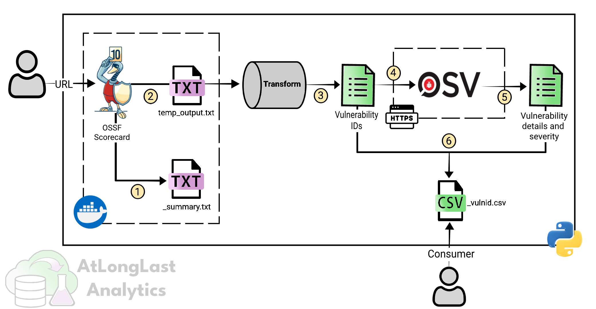

<br>

</img>

# Welcome to VISaR 👋

**Automate vulnerability scanning and reporting using open-source components.**

## What is VISaR?

VISaR (Vulnerability Identification, Scanning and Reporting) is an open-source tool designed to automatically scan code repositories for vulnerabilities. VISaR generates detailed CSV reports summarizing potential issues: an ideal solution for engineers and developers to make informed decisions regarding ensure code safety.

With usability in mind, VISaR is written in Python and uses
best-in-class open-source components; the [OSSF scorecard](https://github.com/ossf/scorecard) for vulnerability identification and the [OSV Database](https://osv.dev/) for vulnerability information.

**Who is VISaR for?**

- **Data Engineers:** Quickly evaluate code before integrating it into your data platform.
- **Software Engineers:** Assess your own code for vulnerabilities before it reaches production systems.
- **Independent Developers and Hobbyists:** Verify code generated by AI assistants or community contributions.


## 1. Using VISaR

**Pre-requisites**

To use VISaR, ensure you have the following:

- Python 3.8+ (the code was developed in Python 3.12)
- [Docker Desktop](https://www.docker.com/products/docker-desktop/)
- The most recent OSSF scorecard Docker image ([follow instructions here](https://github.com/ossf/scorecard?tab=readme-ov-file#installation))
- A classic Github auth token _(settings > Developer Settings > Personal access tokens > Tokens (classic))_ and set the scope to public_repo. This needs to be included in the `.env` file.

**Step-by-Step Instructions**

These instructions are for Windows users only.
1. Clone this repository

2. Create a _.env_ file in the root directory and populate with:

    ```
    GITHUB_AUTH_TOKEN = "<github-auth-token>"
    ```
    
3. Run the _setup_ PowerShell script from the root directory to create a virtual environment, install dependencies, and activate it:

   ```
   ./scripts/setup.ps1
   ```

4. From the root directory, run the test suite using: 

    ``` 
    python -m unittest discover -s tests
    ```

   You should see that all tests have passed. If not, the error message should guide you to the problem.
   
5. Now you are ready to run the pipeline. From the root directory, move into the src folder, and run the application:
  
    ```
    cd src/
    python main.py <full-github-repo>
    ```

<br>
The CSV file generated by a successful run is ready to consume in a tool like Microsoft Excel, see Figure 1. The key columns for decision making are the *Severity* and *Details* which together describe a given vulnerability.

<br>
<br>

<div align="center">
    
</div>

<div align="center">
     <p><strong>Figure 1:</strong> Example VISaR Output</p>
</div>

Example logs for a successful run and a failed run are provided in the [logs directory](./logs/).

## 2. Technical Overview
The user provides a GitHub code repository URL to VISaR which then automatically performs a code scan, sends requests to the OSV API and enriches the data before writing vulnerability information to a CSV file. 

**How VISaR works:**
The workflow is visually described in Figure 2.

  1. OSSF Scorecard scans the repository and generates a summary file.
  2. A second OSSF Scorecard scan generates a file of known vulnerabilties 
  (saved temporarily).
  3. A list of vulnerability IDs are harvested from the temporary data file.
  4. Vulnerability IDs are sent to the OSV API; severity and descriptions are requested.
  5. Key vulnerability information is extracted from the JSON payload. 
  6. The vulnerability IDs, severity, and plain-text summary are compiled into a structured CSV file.

<br>

<div align="center">
    
</div>

<div align="center">
     <p><strong>Figure 2:</strong> VISaR Architecture Diagram</p>
</div>
   
**Overview of the Project Structure** 
The VISaR codebase follows a typical src structure.
- The application code is stored in the `src/` directory, with `main.py` being the main entry point.

- The `helpers/` package contains multiple modules, each containing a logical grouping of functions used in the main application.

- Each module within the `helpers` package has an associated test file in the `tests/` directory. Within each test script, a class groups unit tests for a given function in the corresponding module. We aim to have close to 100% test coverage!

- Run details are captured in a `.log` file found within the `logs` directory. If a run fails, this is where you should start troubleshooting.

- The `data` directory is where you can find the output of completed runs. The files ending with `_vulnerabilties.txt` are the main output containing vulnerability information

- A PowerShell script, `setup.ps1`, is provided in the `scripts` directory. This script should be ran the first time using VISaR, it creates the virtual environment and installs all dependencies for you.


## 3. Contribute
Thank you for wanting to contribute and improve VISaR! We welcome contributions from the community and are grateful for your support.

Before contributing, please read our guidelines which describe our code style, testing approach, etc. here: [/docs/Contributing.md](./docs/Contributing.md).

By contributing to this project, you agree that your contributions will be licensed under the [Apache-2.0 License](LICENSE.txt).

## 4. License

VISaR is completely free, open-source, and licensed under the [Apache-2.0 License](LICENSE.txt).
